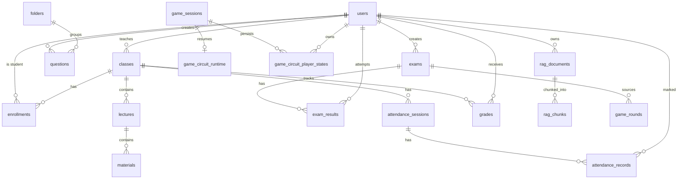

# ARCHITECTURE — Smart_Lecture

## 1. Sơ đồ tổng thể

```
MÁY GIÁO VIÊN                                THIẾT BỊ HỌC VIÊN / GV KHÁC
┌────────────────────────────────────┐       ┌──────────────────┐
│  server/ (Node 24)                  │       │ Browser          │
│  ├── Express :4000                  │       │ http://<ip>:4000 │
│  │   ├── REST API /api/*            │◄─────►│ (điện thoại/     │
│  │   ├── Static web/dist            │WiFi   │  laptop/LAN)     │
│  │   ├── Media stream (Range)       │ LAN   └──────────────────┘
│  │   └── node:sqlite (WAL)          │
│  ├── Socket.IO /game,/live          │
│  ├── RAG worker (chunk + embed)     │
│  └── data/                          │
│      ├── smart-lecture.db           │
│      ├── media/ (video,pdf,pptx...) │
│      ├── secret.key                 │
│      └── backups/                   │
└────────────────────────────────────┘
```

- **Dev mode:** Vite dev server :5173 proxy `/api` + `/socket.io` → :4000
- **Prod mode:** server phục vụ `web/dist` tĩnh → học viên chỉ cần 1 URL duy nhất
- **Khởi động cùng Windows:** Task Scheduler chạy `npm start` trong thư mục server (roadmap P4)

## 2. Cấu trúc monorepo

```
Smart_Lecture/
├── server/            # Backend Node.js + TypeScript (tsx dev, tsc build)
│   └── src/
│       ├── index.ts           # bootstrap: express + socket.io + static
│       ├── config.ts          # port, đường dẫn data, jwt secret loader
│       ├── db/
│       │   ├── connection.ts  # node:sqlite DatabaseSync singleton + migrate
│       │   ├── schema.sql     # DDL toàn bộ bảng
│       │   └── seed.ts        # tạo admin mặc định lần đầu
│       ├── middleware/auth.ts # JWT verify + requireRole()
│       ├── routes/            # auth, users, classes, lectures, materials,
│       │                      # questions, exams, results, grades, attendance,
│       │                      # rag, games, settings, backup
│       ├── services/          # gemini.ts (resilience layer), rag.ts,
│       │                      # docparse.ts, examEngine.ts, excelExport.ts
│       └── realtime/          # gameRoom.ts (Socket.IO rooms)
├── web/               # Frontend React 19 + Vite + TS strict + Tailwind v4
│   └── src/
│       ├── pages/             # theo route role-based
│       ├── components/        # UI dùng chung
│       ├── stores/            # Zustand: auth, ui
│       ├── lib/api.ts         # fetch wrapper gắn JWT + refresh lỗi 401
│       └── realtime/socket.ts # Socket.IO client singleton
├── data/              # runtime (gitignore): db, media, secret, backups
└── .DHSYSTEM/         # artifact quản trị dự án
```

## 3. ERD cơ sở dữ liệu (SQLite)



### Schema chính (chi tiết DDL xem `server/src/db/schema.sql`)
- **users**(id TEXT pk, username UNIQUE, password_hash, role CHECK(admin|teacher|student), display_name, status active|locked, created_at)
- **classes**(id, name, subject, teacher_id FK→users, academic_year, settings_json) 
- **enrollments**(class_id, student_id, PK(class_id,student_id))
- **lectures**(id, class_id, chapter, title, sort_order, description)
- **materials**(id, lecture_id, type CHECK(pdf|docx|pptx|video|link|image), title, file_path NULL nếu link, link_url, size_bytes, page_count)
- **folders**(id, owner_id, name, module CHECK(question|exam))
- **questions**(id, owner_id, type CHECK(mcq|essay), content, options_json, correct_answer, explanation, bloom_level, category, folder_id INDEXED, image_path, is_public_bank, created_at) — *bài học bluebee: bloom/folder/category là cột riêng có index, KHÔNG nhét metadata JSON*
- **exams**(id, creator_id, title, duration_min, question_ids_json, config_json {start_at,end_at,password,shuffle_q,shuffle_o,max_attempts,purpose online_test|self_study,status draft|published,class_id})
- **exam_results**(id, exam_id, student_id, status CHECK(in_progress|disconnected|submitted), remaining_sec, saved_answers_json, score REAL, red_flags, answers_detail_json, ai_evaluation, updated_at, UNIQUE(exam_id,student_id))
- **attendance_sessions**(id, class_id, session_date, periods_total)
- **attendance_records**(session_id, student_id, status CHECK(present|absent|late), periods_absent, reason)
- **grades**(class_id, student_id, kttx REAL NULL, process_1 REAL NULL, final_exam REAL NULL, PRIMARY KEY(class_id,student_id))
- **game_sessions**(id, host_teacher_id, game_type, exam_id NULL, status lobby|running|finished, room_code, started_at)
- **game_results**(game_session_id, student_id, score, rank, detail_json) — với game mạch, detail chỉ lưu metric hoàn thành/lượt nộp có version; không lưu topology hay feedback
- **game_circuit_runtime**(game_session_id PK/FK, challenge_index, challenge_ends_at epoch-ms, is_paused, remaining_ms, updated_at) — deadline tuyệt đối khi chạy; thời lượng còn lại là nguồn sự thật khi pause
- **game_circuit_player_states**(game_session_id, student_id, display_name, score, circuit_json, circuit_challenge_id, simulation_state, measurements_json, completed_challenges_json, last_activity_at epoch-ms, submission_attempts, last_submission_at epoch-ms NULL, last_validation_code NULL, last_validation_feedback NULL, total_submission_attempts, incorrect_submission_attempts, PK(game_session_id,student_id)) — giữ checkpoint challenge hiện tại và bộ đếm tích lũy của cả phòng
- **game_circuit_assistance**(game_session_id, student_id, message_id UNIQUE, kind hint|retry, message, teacher_name, sent_at, delivered_at NULL, acknowledged_at NULL, PK(game_session_id,student_id)) — checkpoint hỗ trợ mới nhất, không phải lịch sử hội thoại
- **rag_documents**(id, owner_id, filename, file_path, mime, status pending|parsing|ready|error, error_msg, page_count)
- **rag_chunks**(id, rag_doc_id, seq, heading_path, text, page, embedding BLOB float32[])

## 4. API sketch (REST, tiền tố /api)

| Nhóm | Endpoint chính | Role |
|---|---|---|
| Auth | POST /auth/login · GET /auth/me · POST /auth/change-password | all |
| Users | POST /users (admin→teacher, teacher→student) · POST /users/import-excel · PATCH /users/:id/status | admin, teacher |
| Classes | CRUD /classes · POST /classes/:id/enroll · GET /classes/mine | teacher, admin |
| Lectures | CRUD /classes/:cid/lectures → /lectures/:id/materials | teacher |
| Materials | POST /materials/upload (multipart) · GET /media/:materialId/stream (Range) | theo lớp |
| Questions | CRUD /questions (+filter type,bloom,folder,q) · POST /questions/bulk · import text | teacher |
| AI | POST /ai/generate-questions (Bloom matrix) · POST /ai/grade-essay · POST /ai/comment-student | teacher only |
| Exams | CRUD /exams · POST /exams/:id/publish · GET /exams/available (student) | phân vai |
| Taking | POST /exams/:id/attempts (tạo/resume attempt) · PUT /attempts/:id/answers · POST /attempts/:id/submit | student |
| Grades | GET /classes/:cid/gradebook · PUT /grades/:sid/:col | teacher |
| Attendance | POST /classes/:cid/sessions · PUT /sessions/:sid/records | teacher |
| RAG | POST /rag/documents (upload) · GET /rag/documents/:id/status · POST /rag/chat (GV) | teacher |
| System | GET /health · GET /system/info (LAN IP + QR payload) · POST /system/backup | admin |
| Circuit debrief | GET /games/:id/circuit-debrief · GET /games/:id/circuit-debrief/export?format=csv\|xlsx · GET /games/mine/recent-circuit-debriefs?classId&limit | host teacher/admin; recent feed is own sessions |

Quy tắc: mọi mutation có zod validate; lỗi chuẩn `{error: {code, message}}`; phân quyền middleware `requireRole('teacher')`.

## 5. Realtime events (Socket.IO)

Namespace mặc định, phòng theo `game:{roomCode}` và `proctor:{examId}`:

| Event (client→server) | Payload | Mô tả |
|---|---|---|
| game:host-attach | {sessionId} | GV tạo phòng gắn/reconnect console; server kiểm tra đúng host trước khi đồng bộ |
| game:join | {roomCode} | HV vào phòng lobby (yêu cầu JWT) |
| game:start | {} | GV bấm bắt đầu |
| game:answer | {questionId, choice, msTaken} | HV trả lời, server tính điểm realtime |
| game:next | {} | GV chuyển câu tiếp |
| proctor:watch | {examId} | GV mở màn hình giám thị |
| circuit_simulate:circuit | {components, wires, submitted} | HV đồng bộ topology; server chỉ tăng attempt, ghi validation và chấm/cộng điểm khi `submitted=true` |
| circuit_simulate:host-control | {action: pause\|resume\|extend\|evaluate\|skip\|restart} | Chỉ host điều khiển challenge; extend +30 giây có cap 10 phút, evaluate dùng grader hiện hữu rồi chuyển bài, skip không chấm, restart không thu hồi điểm đã ghi |
| circuit_simulate:inspect | {userId} | Chỉ host đã attach yêu cầu topology hiện tại của một học viên; server không trả reference circuit |
| circuit_simulate:teacher-message | {userId, kind: hint\|retry, message?} | Chỉ host gửi hỗ trợ riêng tới socket học viên được chọn; hint trim/tối đa 300 ký tự, retry không reset state |
| circuit_simulate:teacher-message-ack | {messageId} | Chỉ học viên đích đang xác thực xác nhận checkpoint mới nhất; sai message/user/session bị bỏ qua |
| proctor:flag | {examId, type} | Server phát khi HV tab-switch |

Server→client: `host:sync`, `lobby:update`, `leaderboard:update`, `question:show`, `game:finish`, `circuit_simulate:challenge`, `circuit_simulate:control_state`, `circuit_simulate:progress`, `circuit_simulate:progress_snapshot`, `circuit_simulate:inspection`, `circuit_simulate:inspection_update`, `circuit_simulate:validation` (selected learner), `circuit_simulate:teacher-message` (selected learner), `circuit_simulate:teacher-message-sent` (requesting host ACK), `circuit_simulate:teacher-message-status` (private host room), `circuit_simulate:teacher-message-acknowledged` (selected learner), `circuit_simulate:restored`, `circuit_simulate:challenge_passed`, `proctor:progress`, `proctor:redflag`.
`host:sync` trả trạng thái công khai của phòng. Với game mạch đang chạy, payload bổ sung challenge hiện tại (không có reference circuit), tối đa 8 dòng hoàn thành dựng từ state server và bảng xếp hạng lấy từ điểm circuit player.
Khi khởi động, server nạp các `circuit_simulate` đang `running`, dựng lại state từng học viên và đặt timer theo phần thời gian còn lại của `challenge_ends_at`; phòng đang pause không đặt timer và giữ nguyên `remaining_ms` kể cả khi deadline cũ đã trôi qua. Học viên reconnect trước giáo viên vẫn có thể lazy-load phòng bằng `roomCode`; completed challenge và cộng KTTX được ghi trong cùng transaction để chống cộng trùng khi process dừng đột ngột.
Topology học viên không được phát vào room chung `game:{roomCode}`. Host hợp lệ được join room riêng `game-host:{sessionId}` để nhận metadata tiến độ; topology đầy đủ chỉ trả trực tiếp cho socket đã gọi inspect và tiếp tục cập nhật theo subscription của socket đó.
`lastActivityAt` là epoch do server cập nhật chỉ khi học viên sửa mạch, gửi đo lường hoặc thao tác mô phỏng; các lần persist/attach/pause không làm mới mốc này. UI host tự suy ra “Cần hỗ trợ” sau 10 giây đối với trạng thái online/working. Hint/retry không broadcast vào room chung, không lưu lịch sử và không thay đổi topology, timer, completion, score hay KTTX.
Checkpoint hỗ trợ mới nhất được persist trước khi phát. Nếu không có socket học viên đích, status là `queued`; mỗi connection mới nhận lại checkpoint chưa acknowledge đúng một lần rồi status thành `delivered`. Học viên xác nhận bằng message id để thành `acknowledged`; `host:sync` khôi phục cả ba trạng thái sau reload/restart. Gửi tin mới thay checkpoint cũ thay vì tạo lịch sử không giới hạn.
Migration v23 bổ sung checkpoint lần nộp hiện tại vào `game_circuit_player_states`. Chỉ payload `submitted=true` tăng `submission_attempts` và ghi thời điểm/mã/phản hồi; đồng bộ topology thông thường không tạo attempt. Mã validation chỉ mô tả nhóm lỗi an toàn (`invalid_data`, `wire_count`, `component_count`, `connection`) hoặc `correct`, không chứa reference topology. Learner đích nhận `circuit_simulate:validation`; host nhận metadata qua progress/inspection room riêng. Checkpoint reset khi chuyển hoặc restart challenge và được khôi phục qua process restart.
Điều khiển nhịp độ P61 tiếp tục dùng `game_circuit_runtime`: `extend` cộng đúng 30 giây vào deadline đang chạy hoặc `remaining_ms` đang pause (cap 10 phút), persist rồi broadcast control state; `evaluate` xóa timer và gọi duy nhất `evaluateCircuitSimulateChallenge` để chấm/chuyển bài. UI readiness chỉ derive completed/submitted/incorrect counts từ progress metadata riêng của host, không yêu cầu topology.
Migration v24 bổ sung `total_submission_attempts` và `incorrect_submission_attempts`. Hai counter chỉ tăng khi learner phát payload `submitted=true`, không reset khi chuyển/làm lại challenge và không tăng do timer/host evaluate. Khi kết thúc, server dựng debrief một lần, phát `circuit_simulate:learning_debrief` chỉ vào host room trước event chung `game:finished`, rồi ghi detail an toàn theo learner ID trong transaction `game_results`; payload/detail không chứa topology, reference circuit, validation feedback hay assistance message.
Read model P63 đọc các result detail version 1 qua Zod, loại dòng legacy/hỏng và tính lại summary từ metric an toàn. Endpoint một phiên kiểm tra đúng host (admin được phép); feed gần đây chỉ quét có giới hạn các phiên `circuit_simulate` đã kết thúc do chính user host và class filter phải qua `canManageClass`. Luồng này không nạp room realtime hay topology.
Export P64 gọi lại cùng loader P63 rồi dựng một ma trận hàng dùng chung cho CSV/XLSX. CSV có UTF-8 BOM; XLSX dùng worksheet `Tổng kết mạch` và độ rộng cột giới hạn. Text do user kiểm soát được prefix dấu nháy nếu bắt đầu bằng ký tự công thức; file không chứa learner ID, topology, feedback, assistance hay raw JSON.
Giới hạn thiết kế: ≤ 60 kết nối/phòng (đủ quy mô lớp).

Host console P65 giữ `useHostConsoleEffects` là chủ sở hữu duy nhất của realtime lifecycle và giữ reducer/callback trong `HostConsole`. Phần render được chia theo lifecycle (header, lobby, giơ tay, ô chữ, kéo co, đua toán, vòng quiz, kết quả) và theo sandbox game (Bingo, Memory Match, Xếp chữ, Quiz Show, Vẽ mạch, Mô phỏng mạch). Các view con chỉ nhận typed props, không đăng ký Socket listener, không gọi API và không tạo nguồn state thứ hai; vì vậy việc mở rộng UI game không làm thay đổi contract server hay persistence.

Monitor hỗ trợ mạch P66 dựng queue qua một pure builder từ progress/assistance hiện tại, giữ thứ tự `priority → lastActivityAt → name`. Component điều phối chỉ sở hữu filter và nội dung hint; queue controls, learner rows, submission/assistance badge, inspection diagnostics, topology read-only và private assistance delivery là các view typed riêng. Việc tách này không tạo thêm subscription, không bulk-load topology và không thay đổi selected-only privacy hoặc checkpoint delivery/acknowledgement.

Luồng tạo game P67 dùng một pure serializer duy nhất cho cả `/games` và `/prepared-games`, với helper circuit template dùng chung cho template mặc định/per-challenge. Question/subject catalogs và circuit draft có hook riêng; controller hook sở hữu state/request, còn `CreateGameWorkspace` chỉ compose selector, crossword, settings và modal. Các validation gate và payload theo mode vì vậy có một nguồn sự thật phía client mà không đổi contract server.

## 6. Luồng RAG pipeline (services/rag.ts)

```
Upload PDF/DOCX/PPTX (multer → data/media/)
  → docparse: pdfjs-serverless (PDF) · mammoth (DOCX) · unzip+XML parse (PPTX)
  → chia khối theo heading (Title/Heading path), 500–1000 token, overlap ~15%
  → metadata: page, heading_path (học thiết kế Chunkr)
  → Gemini text-embedding-001 (batch 100 chunks/request, retry backoff 429)
  → Lưu rag_chunks.embedding BLOB float32
Chat: embed câu hỏi → cosine similarity top-K (in-memory, đủ nhanh ≤50k chunks)
  → inject context vào systemInstruction + trích dẫn [tên tài liệu, trang X]
Rate limit AI: bảng counters trong SQLite (feature, day, count) — quota guard toàn cục
```

## 7. Bảo mật

- JWT HS256, secret random 64 bytes sinh 1 lần lưu `data/secret.key` (0600)
- bcryptjs cost 10; khóa tài khoản sau 10 lần sai liên tiếp (unlock bởi admin/GV chủ lớp)
- CORS chặn theo cấu hình; helmet headers; rate-limit express-rate-limit 300 req/phút/IP
- Upload: whitelist mime + extension, giới hạn 500MB/video, quét phần mở rộng kép; filename lưu uuid, giữ tên gốc trong DB
- SQL: chỉ prepared statements; không bao giờ ghép chuỗi input vào query
- API key Gemini: nhập trong Settings của GV/admin, mã hóa AES-256-GCM bằng secret.key trước khi lưu DB — không bao giờ trả về client sau khi lưu

## 8. Bổ sung ổn định API (2026-08-27)

- Router đơn miền mount theo prefix: `/api/schedule`, `/api/media-audit`, `/api/ai`, `/api/rag`, `/api/system`, `/api/settings`.
- Subject CRUD thuộc `classes.routes.ts`; question CRUD/import/stats thuộc `questions.routes.ts`; backup thuộc `system.routes.ts`. Không mount router trùng.
- `ZodError` và JSON sai cú pháp được error middleware chuẩn hóa thành HTTP 400.
- `DATA_DIR` và `DB_PATH` có thể override bằng biến môi trường; CI/E2E bắt buộc dùng thư mục tạm.
- Restore ghi `restore-pending.db`; lần boot kế tiếp tạo bản DB trước-restore rồi thay DB trước khi mở kết nối SQLite.
- `game_sessions.class_id` là nguồn enrollment gate; mọi event điều khiển host so khớp `host_teacher_id` với JWT socket.
